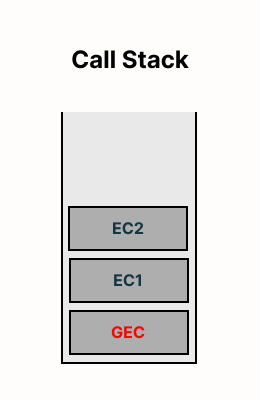
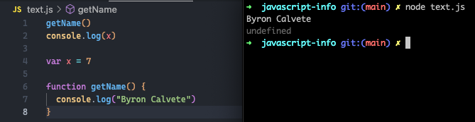

# Series Guide

## How JavaScript Works and Execution Context

Everything in JavaScript happens inside an **Execution Context**.

JavaScript is a **synchronous single-threaded** language.

## How JavaScript code is executed? & Call Stack

When a program runs, we have two phases:
- Memory creation/allocation phase &rarr; In the first phase the JavaScipt skips through the whole program line by line and it allocates memory to all the variables an funcitons (variables with **undefined** and functions as they are).
- Code execution phase &rarr; Change the undefined values of the previous phase for the values that the program has (i.e. 3, 4, etc.). The functions still the same that the previous phase. Now, when you run a function or when you invoke a function, a brand new execution context is created.
- In a function whenever you see a return, this return keyword tells to the function that just return the control back to the execution context where the function was invoke. And its particular execution context (only the function execution context) is deleted.
- Once JavaScript is done with all it's work, now the program is finished and the whole global execution context is deleted.
- Call Stack maintains the **order of execution** of execution contexts. The Call Stack is only for managing Execution contexts (GEC: Global Execution Context, E1: Execution Context 1, E2: Exection Context 2, etc.). After the program is finished, the call stack gets empty. Others names for Call Stack are Execution Content Stack, Program Stack, Control Stack, Runtime Stack and Machine Stack.

## Hoisting in JavaScript (variables & functions)

Hoisting is a phenomenon in JavaScript by you can access these variables and functions even before you have initialized or you put some value in it (in old JavaScript with var declaration).

When we use arrow functions and we try to access to the function before you have initialized, its behavior is like other variable, **undefined** (at this point we use var for declaration).